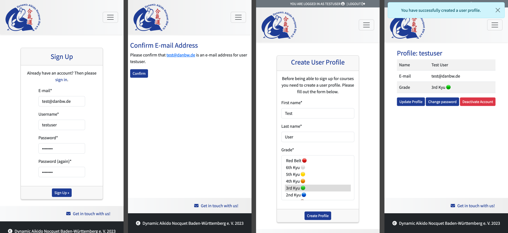
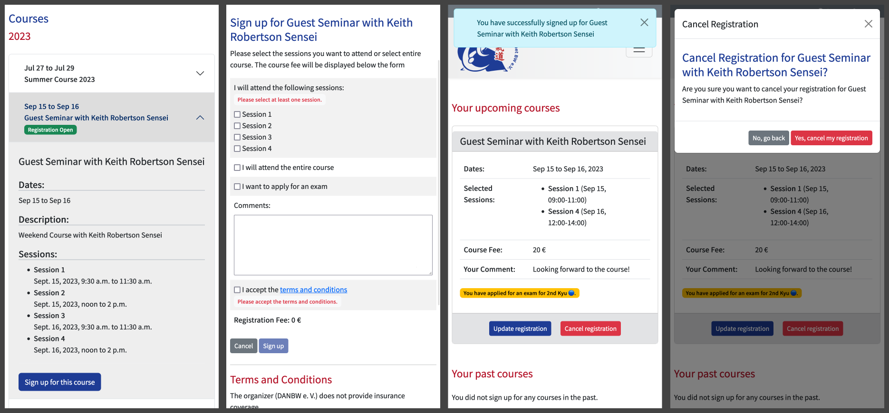
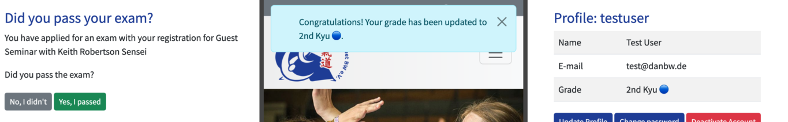
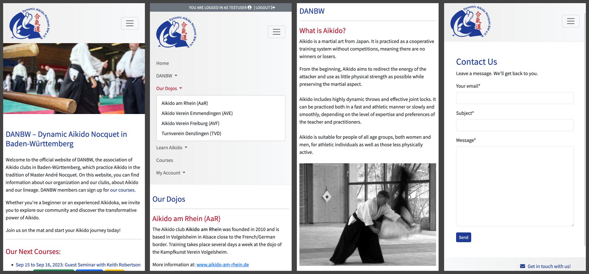
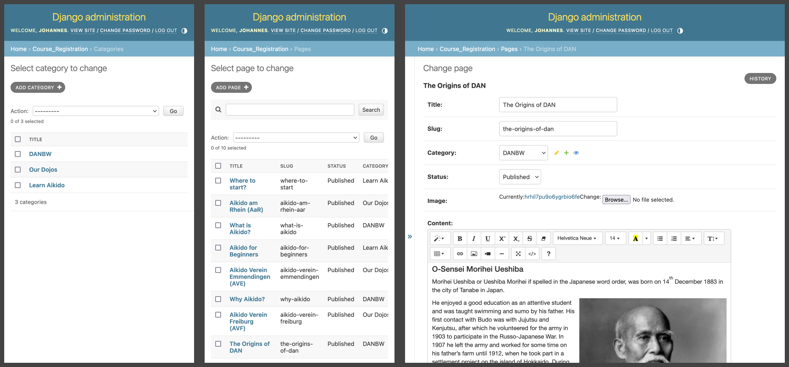

# DANBW Aikido Course Website
## A Django-based course registration website for Dynamic Aikido Nocquet BW (DANBW)
**Dynamic Aikido Nocquet BW** is an Aikido organization based in Baden-Württemberg, Germany. The organization offers Aikido courses several times a year. Members of the organization can sign up for those courses.

This website aims at offering an easy and straightforward way for DANBW members to sign up for courses and manage their course registrations and exams. Furthermore the website allows DANBW staff members to manage courses and course registrations as well as the website content.

DANBW already has a [website](https://www.danbw.de), which is slowly becoming outdated. This project therefore aims at replacing the current website. The project replicated the most important features of the existing website, added a couple of new features and dropped some obsolete features.

The deployed version of the website can be found here: https://aikido-course-website-django-ddffe52bc952.herokuapp.com/

## Table of contents

...

## Features
### Existing Features

#### User Accounts and Profiles
- Users can sign up to the website by providing an email address, a username and a password.
- Users need to confirm their email address, before being able to login to the website.
- After having confirmed their email address, users are asked to create a user profile with their full name and their current Aikido grade.
- Users can see their user profile on the **My Profile** page. From there, they can also update their information or delete their account, if they are regular users (Staff users cannot delete their accounts from the frontend, as a security measure).

#### Course Registration and Management
- Users can sign up for courses by choosing a course with open registration status from the **Courses** page and filling out the sign up form. Users can choose if they want to participate in the whole course or select single sessions. The course fee will be calculated automatically, depending on the selection. Users can also apply for a grading exam. The exam grade will be stored with the registration according to the user's current grade.
- After signing up for a course, users can see their current registrations on the **My Registrations** page. They can update or cancel their registrations, if they wish.

- Upon logging in for the first time after a course with an exam application has passed, the user will be asked to confirm if they have passed their exam.

#### Website UX
- The website has a responsive navigation menu accessible from all pages.
- The start page presents the user with an image slideshow and general information about the organization. Furthermore, the start page features a list of upcoming courses, so that users can immediately see, which courses are available to sign up for.
- There are several other pages available providing detailed information about Aikido, about the organization. Also, visitors, who are interested in learning Aikido can get information on where to start.
- Finally there is a contact page available from the websites footer. Upon submitting the contact form, an email is send to the organization with the user's message.

#### Staff functions
##### Course and Registration Management
- Staff members can manage courses and course registrations from the Django admin site. They can create new courses, update existing courses and see a list of registrations for each course.
- They can also update registrations, for example to update the payment status.
- There are actions available for duplicating courses (in order to minimize the effort for creating new courses, which are similar to existing courses) and for toggling a course's registration status.

##### Content Management
- Staff users can also create new pages or edit existing pages in order to update the website's content.
- Pages are assigned a category and newly created pages will be automatically appear in the main navigation in the appropriate menu item. The order in which pages and categories appear in the navigation can be controlled by assigning a menu position value.
- The page content can be edited with a WYSIWIG editor, which allows for styling and also image upload.

### Future Features
- The following features have not been implemented in the current scope of the project, but could be worth considering for future iterations:
  - Add a breadcrumb navigation to the website in order to further improve user experience.
  - Update a course's registration status automatically based on a registration period. This would require some task scheduling solution on the server, like [Cron](https://wiki.ubuntuusers.de/Cron/).
  - Limit the final fee of a course registration so that the fee for multiple sessions never exceeds the fee for the entire course.
  - Add the option to upload a PDF file or an image as attachment with a course.
  - Add a form for signing up for a membership with the organization.
  - Allow staff users to download course registration data as a CSV file.
- Furthermore, all [user stories, which were not part of the current scope of the project](#user-stories-not-included-in-current-scope), could be reevaluated and considered for future iterations. 

## Design Process

This project was designed with a user-centered approach, keeping the five planes of user experience in mind.

### Strategy Plane

The website's target audience are members of the Aikido organization DANBW. The aim is to provide an easy and intuitive way for members to sign up for courses and manage their course registrations. At the same time, the project wants to make managing courses and registrations as simple as possible for staff members.

The project aims to provide a central platform for DANBW members, which engages its users and offers a positive user experience. This should be part of a strong sense of community, which is an important aspect of DANBW.

### Scope Plane

#### User Stories Within Project Scope
ℹ️ The following user stories were included in the current scope of the project. User stories marked with the https://github.com/nacht-falter/aikido-course-website-django/labels/MVP make up the [Minimum Viable Product](https://en.wikipedia.org/wiki/Minimum_viable_product).

##### THEME: User Accounts and Profiles

###### EPIC: User Registration and Authentication

👉 USER STORY: As a **visitor**, I can **create a user account** so that I can **log in and store my information** (https://github.com/nacht-falter/aikido-course-website-django/issues/2)
https://github.com/nacht-falter/aikido-course-website-django/labels/MVP

Show details

https://github.com/nacht-falter/aikido-course-website-django/labels/THEME%3A%20User%20Accounts%20and%20Profiles
https://github.com/nacht-falter/aikido-course-website-django/labels/EPIC%3A%20User%20Registration%20and%20Authentication
https://github.com/nacht-falter/aikido-course-website-django/labels/PRIORITY%3A%20Must-Have
https://github.com/nacht-falter/aikido-course-website-django/labels/SIZE%3A%20L

###### Acceptance Criteria:

- There is a Sign Up button accessible from everywhere on the website
- Upon clicking on the Sign Up button a user registration form is displayed
- Upon successful registration a new user is created in the database.

###### Tasks:

- Install and setup Django-allauth
- Create UserProfile model with additional fields
- Add Sign Up button to base template and link to allauth registration form
- Create user profile view
- Create user profile template
- Create user profile form

👉 USER STORY: As a **user**, I can **log in to my account** by **clicking on a login button from anywhere on the Website** (https://github.com/nacht-falter/aikido-course-website-django/issues/3)
https://github.com/nacht-falter/aikido-course-website-django/labels/MVP

Show details

https://github.com/nacht-falter/aikido-course-website-django/labels/THEME%3A%20User%20Accounts%20and%20Profiles
https://github.com/nacht-falter/aikido-course-website-django/labels/EPIC%3A%20User%20Registration%20and%20Authentication
https://github.com/nacht-falter/aikido-course-website-django/labels/PRIORITY%3A%20Must-Have
https://github.com/nacht-falter/aikido-course-website-django/labels/SIZE%3A%20L

###### Acceptance Criteria
- There is a login button, which is accessible from everywhere on the website.
- Upon clicking on the button the user is presented with a form for loggingn in with their user credentials.

###### Tasks
- Add login button to base template
- Create login form 

👉 USER STORY: As a **user**, I can **log out from my account** by **clicking on a Logout button from anywhere on the website**. (https://github.com/nacht-falter/aikido-course-website-django/issues/4)
https://github.com/nacht-falter/aikido-course-website-django/labels/MVP

Show details

###### Acceptance Criteria
https://github.com/nacht-falter/aikido-course-website-django/labels/THEME%3A%20User%20Accounts%20and%20Profiles
https://github.com/nacht-falter/aikido-course-website-django/labels/EPIC%3A%20User%20Registration%20and%20Authentication
https://github.com/nacht-falter/aikido-course-website-django/labels/PRIORITY%3A%20Must-Have
https://github.com/nacht-falter/aikido-course-website-django/labels/SIZE%3A%20S

- There is a logout button accessible from anywhere on the website
- Upon clicking on the logout button the user is logged out from the system.

###### Tasks
- Add logout button to base template
- Show logout button only for authenticated users

👉 USER STORY: As a **user**, I can **receive an email** as **confirmation when I create a user account**. (https://github.com/nacht-falter/aikido-course-website-django/issues/5)

Show details

https://github.com/nacht-falter/aikido-course-website-django/labels/THEME%3A%20User%20Accounts%20and%20Profiles
https://github.com/nacht-falter/aikido-course-website-django/labels/EPIC%3A%20User%20Registration%20and%20Authentication
https://github.com/nacht-falter/aikido-course-website-django/labels/PRIORITY%3A%20Should-Have
https://github.com/nacht-falter/aikido-course-website-django/labels/SIZE%3A%20M

###### Acceptance Criteria
- After creating an account the user will receive an e-mail as confirmation.
- The email contains relevant details about the account and a confirmation message.

###### Tasks
- Set up email functionality in Django
- Send confirmation e-mail after account creation
- Create sendmail function in view to send the confirmation email upon successful account creation

###### EPIC: User Account Management

👉 USER STORY: As a **logged-in user**, I can **view my user profile** (https://github.com/nacht-falter/aikido-course-website-django/issues/6)

Show details

https://github.com/nacht-falter/aikido-course-website-django/labels/THEME%3A%20User%20Accounts%20and%20Profiles
https://github.com/nacht-falter/aikido-course-website-django/labels/EPIC%3A%20User%20Account%20Management
https://github.com/nacht-falter/aikido-course-website-django/labels/PRIORITY%3A%20Should-Have
https://github.com/nacht-falter/aikido-course-website-django/labels/SIZE%3A%20M

###### Acceptance Criteria
- There is a link in the navigation for logged in user which brings them to their user profile.
- The user profile displays user data and includes a link to the user's course registration list. 

###### Tasks
- Create UserProfile model to extend User model
- Create view for user profiles
- Update template for user profile
- Update base template
- Test model and view

👉 USER STORY: As a **logged-in user**, I can **update my user profile** (https://github.com/nacht-falter/aikido-course-website-django/issues/7)

Show details

https://github.com/nacht-falter/aikido-course-website-django/labels/THEME%3A%20User%20Accounts%20and%20Profiles
https://github.com/nacht-falter/aikido-course-website-django/labels/EPIC%3A%20User%20Account%20Management
https://github.com/nacht-falter/aikido-course-website-django/labels/PRIORITY%3A%20Should-Have
https://github.com/nacht-falter/aikido-course-website-django/labels/SIZE%3A%20M

###### Acceptance Criteria
- A user can click on a link to edit the user's profile on the profile page.
- Upon clicking that link, a form for editing the user's data will appear.
- After submitting the form the updated data is stored in the database.

###### Tasks
- Create form for editing user profile with the following fields: first name, last name, username, email, grade
- Create view for editing the profile
- Register urls
- Write tests

👉 USER STORY: As a **logged-in user**, I can **reset my password** (https://github.com/nacht-falter/aikido-course-website-django/issues/8)
https://github.com/nacht-falter/aikido-course-website-django/labels/MVP

Show details

https://github.com/nacht-falter/aikido-course-website-django/labels/THEME%3A%20User%20Accounts%20and%20Profiles
https://github.com/nacht-falter/aikido-course-website-django/labels/EPIC%3A%20User%20Account%20Management
https://github.com/nacht-falter/aikido-course-website-django/labels/PRIORITY%3A%20Must-Have
https://github.com/nacht-falter/aikido-course-website-django/labels/SIZE%3A%20S

###### Acceptance Criteria
- Users can reset their password by clicking on a link on their profile page

###### Tasks
- Include link to account_change_password url from allauth in user profile template
- Adjust allauth change password template

👉 USER STORY: As a **logged-in user**, I can **delete my account** (https://github.com/nacht-falter/aikido-course-website-django/issues/9)

Show details

https://github.com/nacht-falter/aikido-course-website-django/labels/THEME%3A%20User%20Accounts%20and%20Profiles
https://github.com/nacht-falter/aikido-course-website-django/labels/EPIC%3A%20User%20Account%20Management
https://github.com/nacht-falter/aikido-course-website-django/labels/PRIORITY%3A%20Could-Have
https://github.com/nacht-falter/aikido-course-website-django/labels/SIZE%3A%20S

###### Acceptance Criteria
- Users can delete or deactivate their account by clicking on a link
- After the user confirms they want to delete/deactivate the account, the user will be removed from the system

###### Tasks
- Create deactivate user view
- Create deactivate user template
- Write tests for view

###### EPIC: Course Registration

👉 USER STORY: As a **visitor**, I can **click on a link in the navigation menu** to **see a list of available courses** (https://github.com/nacht-falter/aikido-course-website-django/issues/11)
https://github.com/nacht-falter/aikido-course-website-django/labels/MVP

Show details

https://github.com/nacht-falter/aikido-course-website-django/labels/THEME%3A%20Course%20Registration%20and%20Management
https://github.com/nacht-falter/aikido-course-website-django/labels/EPIC%3A%20Course%20Registration
https://github.com/nacht-falter/aikido-course-website-django/labels/PRIORITY%3A%20Must-Have
https://github.com/nacht-falter/aikido-course-website-django/labels/SIZE%3A%20M

###### Acceptance Criteria
- There is a list of all courses available at a URL.
- Theres is a navigation menu containing a link to the URL to the course list.

###### Tasks
- Create course list view
- Create base template with navigation menu containing a link to the course list page
- Create course list template
- Register URL
- Test view

👉 USER STORY: As a **visitor** or a **logged-in user**, I can **see the fees for the course, depending on how many sessions I have selected** (https://github.com/nacht-falter/aikido-course-website-django/issues/13)

Show details

https://github.com/nacht-falter/aikido-course-website-django/labels/THEME%3A%20Course%20Registration%20and%20Management
https://github.com/nacht-falter/aikido-course-website-django/labels/EPIC%3A%20Course%20Registration
https://github.com/nacht-falter/aikido-course-website-django/labels/PRIORITY%3A%20Should-Have
https://github.com/nacht-falter/aikido-course-website-django/labels/SIZE%3A%20XL

###### Acceptance Criteria
- Upon filling out a course registration form the user can see, what the course fees will be.
- The course fees change, depending on if the user selects single sessions or the entire course.
- The course fee will be stored with the registration upon submitting the form.

###### Tasks
- Add course sessions to course registration form
- Create logic for calculating the course fees to the post method of the course registration view.
- Add javascript to the template in order to display the fees dynamically.
- Write tests for view

👉 USER STORY: As a **visitor** or a **logged-in user**, I can **receive an email as confirmation**, **after signing up for a course, containing course and payment details so that I have a backup of all relevant details** (https://github.com/nacht-falter/aikido-course-website-django/issues/14)

Show details

https://github.com/nacht-falter/aikido-course-website-django/labels/THEME%3A%20Course%20Registration%20and%20Management
https://github.com/nacht-falter/aikido-course-website-django/labels/EPIC%3A%20Course%20Registration
https://github.com/nacht-falter/aikido-course-website-django/labels/PRIORITY%3A%20Should-Have
https://github.com/nacht-falter/aikido-course-website-django/labels/SIZE%3A%20S

###### Acceptance Criteria
- After signing up for a course users will receive an email confirming the successful registration.
- The email contains details about the course and the registration.

###### Tasks
- Update RegisterCourse view to send email upon successful registration
- Include course and registration details in email

👉 USER STORY: As a **logged-in user**, I can **fill out a sign-up form** to **sign up for a course** (https://github.com/nacht-falter/aikido-course-website-django/issues/43)
https://github.com/nacht-falter/aikido-course-website-django/labels/MVP

Show details

https://github.com/nacht-falter/aikido-course-website-django/labels/THEME%3A%20Course%20Registration%20and%20Management
https://github.com/nacht-falter/aikido-course-website-django/labels/EPIC%3A%20Course%20Registration
https://github.com/nacht-falter/aikido-course-website-django/labels/PRIORITY%3A%20Must-Have
https://github.com/nacht-falter/aikido-course-website-django/labels/SIZE%3A%20L

###### Acceptance Criteria
- A logged-in user can click on a link in the course with open registration status and will be directed to to a registration form.
- The registration-form provides fields for all necessary details.
- Upon filling out the form, a new registration will be stored in the database.

###### Tasks
- Create course registration form
- Create registration form template
- Create view
- Register url
- Write tests for form and view

###### EPIC: Course Registration Management

👉 USER STORY: As a **logged-in user**, I can **see a list of my current and past registrations** (https://github.com/nacht-falter/aikido-course-website-django/issues/15)

Show details

https://github.com/nacht-falter/aikido-course-website-django/labels/THEME%3A%20Course%20Registration%20and%20Management
https://github.com/nacht-falter/aikido-course-website-django/labels/EPIC%3A%20Course%20Registration%20Management
https://github.com/nacht-falter/aikido-course-website-django/labels/PRIORITY%3A%20Should-Have
https://github.com/nacht-falter/aikido-course-website-django/labels/SIZE%3A%20XS

###### Acceptance Criteria
- The user can see a list of their current and past registrations in separete sections of the registrations list.

###### Tasks
- Update registration list template to separate between current and past registrations

👉 USER STORY: As a **logged-in user**, I can **edit my current registrations** so that **I can update information** (https://github.com/nacht-falter/aikido-course-website-django/issues/16)
https://github.com/nacht-falter/aikido-course-website-django/labels/MVP

Show details

https://github.com/nacht-falter/aikido-course-website-django/labels/THEME%3A%20Course%20Registration%20and%20Management
https://github.com/nacht-falter/aikido-course-website-django/labels/EPIC%3A%20Course%20Registration%20Management
https://github.com/nacht-falter/aikido-course-website-django/labels/PRIORITY%3A%20Must-Have
https://github.com/nacht-falter/aikido-course-website-django/labels/SIZE%3A%20L

###### Acceptance Criteria
- Users can see a list of their current registrations.
- Users can click on a current registration and be redirected to a form for editing their registration.
- After submitting the form the updated data will be stored in the database.

###### Tasks
- Create view to list registrations.
- Create template for registration list with edit registration button.
- Create view for editing registration
- Test views

👉 USER STORY: As a **logged-in user**, I can **cancel a course registration** (https://github.com/nacht-falter/aikido-course-website-django/issues/17)
https://github.com/nacht-falter/aikido-course-website-django/labels/MVP

Show details

https://github.com/nacht-falter/aikido-course-website-django/labels/THEME%3A%20Course%20Registration%20and%20Management
https://github.com/nacht-falter/aikido-course-website-django/labels/EPIC%3A%20Course%20Registration%20Management
https://github.com/nacht-falter/aikido-course-website-django/labels/PRIORITY%3A%20Must-Have
https://github.com/nacht-falter/aikido-course-website-django/labels/SIZE%3A%20L

###### Acceptance Criteria
- Users can see a list of their current registrations.
- Users can cancel registrations by clicking on a cancel registration button.
- Users will be asked for confirmation before the registration is cancelled.

###### Tasks
- Create view to list registrations
- Create view to delete registration
- Create templates for registration list with cancel button and confirmation
- Create navigation link to users registrations page
- Register urls
- Write tests for views

👉 USER STORY: As a **visitor** or a **logged-in user**, I can **see if I applied for an exam after I signed up for a course** (https://github.com/nacht-falter/aikido-course-website-django/issues/20)

Show details

https://github.com/nacht-falter/aikido-course-website-django/labels/THEME%3A%20Course%20Registration%20and%20Management
https://github.com/nacht-falter/aikido-course-website-django/labels/EPIC%3A%20Exams
https://github.com/nacht-falter/aikido-course-website-django/labels/PRIORITY%3A%20Should-Have
https://github.com/nacht-falter/aikido-course-website-django/labels/SIZE%3A%20S

###### Acceptance Criteria
- In the list of the users current registrations there is a message indicating if the user has applied for an exam.

###### Tasks
- Add exam field to registration list template

###### EPIC: Exams

👉 USER STORY: As a **logged-in user**, I can **receive a notification after logging in if I have previously applied for an exam** so that **I can update my user profile accordingly** (https://github.com/nacht-falter/aikido-course-website-django/issues/22)

Show details

https://github.com/nacht-falter/aikido-course-website-django/labels/THEME%3A%20Course%20Registration%20and%20Management
https://github.com/nacht-falter/aikido-course-website-django/labels/EPIC%3A%20Exams
https://github.com/nacht-falter/aikido-course-website-django/labels/PRIORITY%3A%20Could-Have
https://github.com/nacht-falter/aikido-course-website-django/labels/SIZE%3A%20XL

###### Acceptance Criteria
- After applying for an exam and after the course has passed, the user will be presented with a dialogue asking if they want to update their grade.
- If the user confirms that they passed their exam the registration will be updated to include the information in the exam_passed field.

###### Tasks
- Add logic for checking if the user has applied for an exam and if the course has passed to user profile view
- Create view for displaying the notification.
- Add exam_passed field to CourseRegistration model
- Display if exam has been passed in  the course registration view
- Write tests for views

👉 USER STORY: As a **logged-in user** I can **see what exam I applied for in the list of my past and current registrations** (https://github.com/nacht-falter/aikido-course-website-django/issues/45)

Show details

https://github.com/nacht-falter/aikido-course-website-django/labels/THEME%3A%20Course%20Registration%20and%20Management
https://github.com/nacht-falter/aikido-course-website-django/labels/EPIC%3A%20Exams
https://github.com/nacht-falter/aikido-course-website-django/labels/PRIORITY%3A%20Could-Have
https://github.com/nacht-falter/aikido-course-website-django/labels/SIZE%3A%20XS

###### Acceptance Criteria
- If the user applied for an exam with a course registration, the grade they applied for is displayed with the registration in the course registration list.

###### Tasks
- Display exam grade in course registration list template

##### THEME: Website UX

###### EPIC: UI Design

👉 USER STORY: As a **visitor** or a **logged-in user**, I want **the website to have a responsive, consistent and visually appealing UI design** in order to **elicit a positive response during my visit** (https://github.com/nacht-falter/aikido-course-website-django/issues/36)
https://github.com/nacht-falter/aikido-course-website-django/labels/MVP

Show details

https://github.com/nacht-falter/aikido-course-website-django/labels/THEME%3A%20Website%20UX
https://github.com/nacht-falter/aikido-course-website-django/labels/EPIC%3A%20UI%20Design
https://github.com/nacht-falter/aikido-course-website-django/labels/PRIORITY%3A%20Must-Have
https://github.com/nacht-falter/aikido-course-website-django/labels/SIZE%3A%20XL

###### Acceptance Criteria
- The website has a consistent layout and styling over all pages.
- The website is responsive for different screen sizes.
-  The website uses colors and images which represent the organization.

###### Tasks
- Add bootstrap to base template
- Create basic bootstrap layout and styling
- Include images on the home page

👉 USER STORY: As a **user**, I want **the website to comply with accessibility guidelines** so that **I can access it with screen readers or other assistive technologies** (https://github.com/nacht-falter/aikido-course-website-django/issues/55)
https://github.com/nacht-falter/aikido-course-website-django/labels/MVP

Show details

https://github.com/nacht-falter/aikido-course-website-django/labels/THEME%3A%20Website%20UX
https://github.com/nacht-falter/aikido-course-website-django/labels/EPIC%3A%20UI%20Design
https://github.com/nacht-falter/aikido-course-website-django/labels/PRIORITY%3A%20Must-Have
https://github.com/nacht-falter/aikido-course-website-django/labels/SIZE%3A%20S

###### Acceptance Criteria
- The templates use accessibility labels and elements where appropriate.

###### Tasks
- Use aria-labels where necessary
- Fix suggestions from 
- User semantic html elements in base template

👉 USER STORY: As a **visitor or logged-in user** I can **see messages with different colors** so that **I can get feedback for my actions.** (https://github.com/nacht-falter/aikido-course-website-django/issues/56)

Show details

https://github.com/nacht-falter/aikido-course-website-django/labels/THEME%3A%20Website%20UX
https://github.com/nacht-falter/aikido-course-website-django/labels/EPIC%3A%20UI%20Design
https://github.com/nacht-falter/aikido-course-website-django/labels/PRIORITY%3A%20Should-Have
https://github.com/nacht-falter/aikido-course-website-django/labels/SIZE%3A%20S

###### Acceptance Criteria
- There are messages displayed, when the user submits forms.
- The messages have different colors depending on their type. 

###### Tasks
- Add bootstrap alert class to messages
- Set up messages typse in settings.py
- Add styling to alerts types

👉 USER STORY: As a **logged-in user**  I can **see if I am logged in or not** (https://github.com/nacht-falter/aikido-course-website-django/issues/66)

Show details

https://github.com/nacht-falter/aikido-course-website-django/labels/THEME%3A%20Website%20UX
https://github.com/nacht-falter/aikido-course-website-django/labels/EPIC%3A%20UI%20Design
https://github.com/nacht-falter/aikido-course-website-django/labels/PRIORITY%3A%20Should-Have
https://github.com/nacht-falter/aikido-course-website-django/labels/SIZE%3A%20S

###### Acceptance Criteria
- There is an indicator on the website showing logged-in users, that they are logged in.

###### Tasks
- Include indicator for authentication status in base.html template

###### EPIC: Navigation

👉 USER STORY: As a **visitor** or **logged-in user**, I can **easily navigate through different sections of the website using a clear and intuitive navigation menu displayed on all pages** (https://github.com/nacht-falter/aikido-course-website-django/issues/23)
https://github.com/nacht-falter/aikido-course-website-django/labels/MVP

Show details

https://github.com/nacht-falter/aikido-course-website-django/labels/THEME%3A%20Website%20UX
https://github.com/nacht-falter/aikido-course-website-django/labels/EPIC%3A%20Navigation
https://github.com/nacht-falter/aikido-course-website-django/labels/PRIORITY%3A%20Must-Have
https://github.com/nacht-falter/aikido-course-website-django/labels/SIZE%3A%20M

###### Acceptance Criteria
- There is a navigation menu displayed on all pages.
- The navigation menu is responsive so that it is easily accessible on all devices

###### Tasks
- Add bootstrap classes and js to navigation in order to style it and make it responsive

👉 USER STORY: As a **Visitor or logged-in user** I can **see a custom error page with a link to the homepage**, when I try to access a URL that doesn't exist (https://github.com/nacht-falter/aikido-course-website-django/issues/50)

Show details

https://github.com/nacht-falter/aikido-course-website-django/labels/THEME%3A%20Website%20UX
https://github.com/nacht-falter/aikido-course-website-django/labels/EPIC%3A%20Navigation
https://github.com/nacht-falter/aikido-course-website-django/labels/PRIORITY%3A%20Should-Have
https://github.com/nacht-falter/aikido-course-website-django/labels/SIZE%3A%20XS

###### Acceptance Criteria
- There is a custom error page with a link to the homepage.
- The page is displayed when a 404 error comes up instead of the default 404 error page.

###### Tasks
- Create a custom 404 error template

###### EPIC: Website Content

👉 USER STORY: As a **user**, I want **the start page to display information about the website's purpose** (https://github.com/nacht-falter/aikido-course-website-django/issues/25)
https://github.com/nacht-falter/aikido-course-website-django/labels/MVP

Show details

https://github.com/nacht-falter/aikido-course-website-django/labels/THEME%3A%20Website%20UX
https://github.com/nacht-falter/aikido-course-website-django/labels/EPIC%3A%20Website%20Content
https://github.com/nacht-falter/aikido-course-website-django/labels/PRIORITY%3A%20Must-Have
https://github.com/nacht-falter/aikido-course-website-django/labels/SIZE%3A%20XS

###### Acceptance Criteria
- The homepage includes information about the website's purpose and a short description.

###### Tasks
- Add description of the organization and the purpose of the website to the home page template

👉 USER STORY: As a **user**, I want **the start page to display the latest courses and currently open course registrations** so that **I can quickly access them** (https://github.com/nacht-falter/aikido-course-website-django/issues/26)

Show details

https://github.com/nacht-falter/aikido-course-website-django/labels/THEME%3A%20Website%20UX
https://github.com/nacht-falter/aikido-course-website-django/labels/EPIC%3A%20Website%20Content
https://github.com/nacht-falter/aikido-course-website-django/labels/PRIORITY%3A%20Should-Have
https://github.com/nacht-falter/aikido-course-website-django/labels/SIZE%3A%20M

###### Acceptance Criteria
- There is a list of upcoming courses on the home page.
- Users can see which courses are open for registration.

###### Tasks
- Add list of upcoming courses to index.html
- Mark courses with open registrations with a badge

👉 USER STORY: As a **user**, I want **the start page to display the latest courses and currently open course registrations** so that **I can quickly access them** (https://github.com/nacht-falter/aikido-course-website-django/issues/27)

Show details

https://github.com/nacht-falter/aikido-course-website-django/labels/THEME%3A%20Website%20UX
https://github.com/nacht-falter/aikido-course-website-django/labels/EPIC%3A%20Website%20Content
https://github.com/nacht-falter/aikido-course-website-django/labels/PRIORITY%3A%20Should-Have
https://github.com/nacht-falter/aikido-course-website-django/labels/SIZE%3A%20L

###### Acceptance Criteria
- There are pages for accessing information about the organization accessible from the navigation menu.
- There is a page with links to the websites of all Aikido Dojos which are part of the organization.
- There is information available for beginners so that they can find out where they can start learning Aikido.

###### Tasks
- Create pages for information about Aikido, about Danbw, about the Dojos, and for beginners
- Include pages in navigation menu

👉 USER STORY: As a **visitor or logged-in user**, I can **fill out a contact form** so that **I can get in touch with the team** (https://github.com/nacht-falter/aikido-course-website-django/issues/27)

Show details

https://github.com/nacht-falter/aikido-course-website-django/labels/THEME%3A%20Website%20UX
https://github.com/nacht-falter/aikido-course-website-django/labels/EPIC%3A%20Website%20Content
https://github.com/nacht-falter/aikido-course-website-django/labels/PRIORITY%3A%20Should-Have
https://github.com/nacht-falter/aikido-course-website-django/labels/SIZE%3A%20L

###### Acceptance Criteria
- There is a contact page, which is accessible from the footer.
- There is a contact form on the contact page, which allows users to contact the organization.

###### Tasks
- Set up email backend
- Create contact view
- Create contact form
- Create template

###### EPIC: Course Management

👉 USER STORY: As a **staff member**, I can **create new courses** (https://github.com/nacht-falter/aikido-course-website-django/issues/30)
https://github.com/nacht-falter/aikido-course-website-django/labels/MVP

Show details

https://github.com/nacht-falter/aikido-course-website-django/labels/THEME%3A%20Staff%20functions
https://github.com/nacht-falter/aikido-course-website-django/labels/EPIC%3A%20Course%20Management
https://github.com/nacht-falter/aikido-course-website-django/labels/PRIORITY%3A%20Must-Have
https://github.com/nacht-falter/aikido-course-website-django/labels/SIZE%3A%20L

###### Acceptance Criteria
- A staff member can login to the Django backend and create new course items by clicking on 'Add Course' and fill out the course details
- All form fields are validated according to their field type.
- Slug field is auto completed

###### Tasks
-  Create Course model according to ERD (MVP version)
- Register Course model in admin view
- Add custom validation to date fields
- Add auto fill method for slug field
-  Write tests for the model

👉 USER STORY: As a **staff member**, I can **duplicate existing courses** (https://github.com/nacht-falter/aikido-course-website-django/issues/31)

Show details

https://github.com/nacht-falter/aikido-course-website-django/labels/THEME%3A%20Staff%20functions
https://github.com/nacht-falter/aikido-course-website-django/labels/EPIC%3A%20Course%20Management
https://github.com/nacht-falter/aikido-course-website-django/labels/PRIORITY%3A%20Should-Have
https://github.com/nacht-falter/aikido-course-website-django/labels/SIZE%3A%20S

###### Acceptance Criteria
- Staff members can see existing courses in the Django backend and duplicate a course by clicking on a course in the list and select a duplicate course method.

###### Tasks
- Create method for course duplication and register it in the admin view
- Write tests for duplication method

👉 USER STORY: As a **staff member**, I can **update or delete existing courses** (https://github.com/nacht-falter/aikido-course-website-django/issues/32)
https://github.com/nacht-falter/aikido-course-website-django/labels/MVP

Show details

https://github.com/nacht-falter/aikido-course-website-django/labels/THEME%3A%20Staff%20functions
https://github.com/nacht-falter/aikido-course-website-django/labels/EPIC%3A%20Course%20Management
https://github.com/nacht-falter/aikido-course-website-django/labels/PRIORITY%3A%20Must-Have
https://github.com/nacht-falter/aikido-course-website-django/labels/SIZE%3A%20XS

###### Acceptance Criteria
- Staff members can update courses from the Django admin backend
- Staff members can delete courses from the Django admin backend
- Staff members can see the properties of existing courses in the django admin backend course list.

###### Tasks
- Adjust admin view for courses to include course details.

👉 USER STORY: As a **staff member**, I can **click on a course to see all registrations for a course** (https://github.com/nacht-falter/aikido-course-website-django/issues/33)

Show details

https://github.com/nacht-falter/aikido-course-website-django/labels/THEME%3A%20Staff%20functions
https://github.com/nacht-falter/aikido-course-website-django/labels/EPIC%3A%20Course%20Management
https://github.com/nacht-falter/aikido-course-website-django/labels/PRIORITY%3A%20Could-Have
https://github.com/nacht-falter/aikido-course-website-django/labels/SIZE%3A%20L

###### Acceptance Criteria
- When clicking on a Course in the Django backend, staff users can see a list of all registrations for the course.

###### Tasks
- Create CourseRegistration model
- Create CourseSessions model
- Register CourseRegistrations as a field of Courses in the admin view as an inline
- Write tests for CourseRegistration and CourseSessions model

👉 USER STORY: As a **staff member**, I can **click on a course to see all sessions associated with the course** (https://github.com/nacht-falter/aikido-course-website-django/issues/41)

Show details

https://github.com/nacht-falter/aikido-course-website-django/labels/THEME%3A%20Staff%20functions
https://github.com/nacht-falter/aikido-course-website-django/labels/EPIC%3A%20Course%20Management
https://github.com/nacht-falter/aikido-course-website-django/labels/PRIORITY%3A%20Should-Have
https://github.com/nacht-falter/aikido-course-website-django/labels/SIZE%3A%20S

###### Acceptance Criteria
- When clicking on a Course in the Django backend, staff users can see a list of all sessions for the course.

###### Tasks
- Register CourseSessions as a field of Courses in the admin view as an inline

👉 USER STORY: As a **staff member** I can **see the number of registrations for each course in the course list in the Django admin backend** so that **I can access that information without having to click on a course first.** (https://github.com/nacht-falter/aikido-course-website-django/issues/42)

Show details

https://github.com/nacht-falter/aikido-course-website-django/labels/THEME%3A%20Staff%20functions
https://github.com/nacht-falter/aikido-course-website-django/labels/EPIC%3A%20Course%20Management
https://github.com/nacht-falter/aikido-course-website-django/labels/PRIORITY%3A%20Could-Have
https://github.com/nacht-falter/aikido-course-website-django/labels/SIZE%3A%20S

###### Acceptance Criteria
- The number of registrations for each course are displayed in the course list in the Django admin view.

###### Tasks
- Create method for getting registration count
- Add method to courses_list display
- Write tests for method

👉 USER STORY: As a **staff member** I can **use a WYSIWIG editor in the Django backend** so that **I have more control over layout and styling.** (https://github.com/nacht-falter/aikido-course-website-django/issues/44)

Show details

https://github.com/nacht-falter/aikido-course-website-django/labels/THEME%3A%20Staff%20functions
https://github.com/nacht-falter/aikido-course-website-django/labels/EPIC%3A%20Course%20Management
https://github.com/nacht-falter/aikido-course-website-django/labels/PRIORITY%3A%20Could-Have
https://github.com/nacht-falter/aikido-course-website-django/labels/SIZE%3A%20S

###### Acceptance Criteria
- There is a WYSIWIG editor installed that staff members can use for editing text fields.

###### Tasks
- Install and setup summernote.
- Adjust admin view to use summernote fields for text fields.

👉 USER STORY: As a **staff member** I can **toggle a courses registration status from the course list in the Django amdin backend** without **having to click on the course first.** (https://github.com/nacht-falter/aikido-course-website-django/issues/47)

Show details

https://github.com/nacht-falter/aikido-course-website-django/labels/THEME%3A%20Staff%20functions
https://github.com/nacht-falter/aikido-course-website-django/labels/EPIC%3A%20Course%20Management
https://github.com/nacht-falter/aikido-course-website-django/labels/PRIORITY%3A%20Should-Have
https://github.com/nacht-falter/aikido-course-website-django/labels/SIZE%3A%20XS

###### Acceptance Criteria
- There is an action for toggling the registration status in the action dropdown list in the course view of the Django backend.

###### Tasks
- Add action to CourseAdmin view which toggles the courses registration_status

###### EPIC: Content Management

👉 USER STORY: As a **staff member**, I can **create new pages and edit existing pages** so that **I can add new content to the website**. (https://github.com/nacht-falter/aikido-course-website-django/issues/35)

Show details

https://github.com/nacht-falter/aikido-course-website-django/labels/THEME%3A%20Staff%20functions
https://github.com/nacht-falter/aikido-course-website-django/labels/EPIC%3A%20Content%20Management
https://github.com/nacht-falter/aikido-course-website-django/labels/PRIORITY%3A%20Could-Have
https://github.com/nacht-falter/aikido-course-website-django/labels/SIZE%3A%20XL

###### Acceptance Criteria
- Staff members can add pages from the admin view
- Staff members can define for pages
- Published pages are displayed in the main navigation automatically
- Staff members can use a WYSIWIG editor to edit the page contents

###### Tasks
- Create page model
- Create category model
- Register models to the admin site
- Create views for page display
- Update base.html template to include links to pages sorted by category in the navigation
- Write tests for models and views

#### User Stories Not Included in Current Scope
ℹ️ The following user stories were not included in the current scope of the project.

👉 USER STORY: As a **logged-in user**, I can receive an email as confirmation when I delete my account (https://github.com/nacht-falter/aikido-course-website-django/issues/10)

Show details

https://github.com/nacht-falter/aikido-course-website-django/labels/THEME%3A%20User%20Accounts%20and%20Profiles
https://github.com/nacht-falter/aikido-course-website-django/labels/EPIC%3A%20User%20Account%20Management
https://github.com/nacht-falter/aikido-course-website-django/labels/PRIORITY%3A%20Won%27t-Have
https://github.com/nacht-falter/aikido-course-website-django/labels/SIZE%3A%20S

###### Acceptance Criteria
- Users receive an email as confirmation, when they have deactivated their account.

###### Tasks
- Add sendemail function to DeactivateAccount view

👉 USER STORY: As a **visitor**, I can **fill out a registration form** to **sign up for a course** (https://github.com/nacht-falter/aikido-course-website-django/issues/12)

Show details

https://github.com/nacht-falter/aikido-course-website-django/labels/THEME%3A%20Course%20Registration%20and%20Management
https://github.com/nacht-falter/aikido-course-website-django/labels/EPIC%3A%20Course%20Registration
https://github.com/nacht-falter/aikido-course-website-django/labels/PRIORITY%3A%20Won%27t-Have
https://github.com/nacht-falter/aikido-course-website-django/labels/SIZE%3A%20L

###### Acceptance Criteria
- A visitor can sign up for courses without having to create a user account.
- The registration will be saved in the database upon submitting a registration form.

###### Tasks
- Create model for visitor registrations
- Create registration form and view
- Add template

👉 USER STORY: As a **logged-in user**, I can **receive an email as confirmation when I updated a registration** (https://github.com/nacht-falter/aikido-course-website-django/issues/18)

Show details

https://github.com/nacht-falter/aikido-course-website-django/labels/THEME%3A%20Course%20Registration%20and%20Management
https://github.com/nacht-falter/aikido-course-website-django/labels/EPIC%3A%20Course%20Registration%20Management
https://github.com/nacht-falter/aikido-course-website-django/labels/PRIORITY%3A%20Won%27t-Have
https://github.com/nacht-falter/aikido-course-website-django/labels/SIZE%3A%20S

###### Acceptance Criteria
- After updating a course registration the user wil receive an email with the updated information.

###### Tasks
- Add sendemail function to update course registration view

👉 USER STORY: As a **logged-in user**, I can **receive an email as confirmation when I canceled a registration.** (https://github.com/nacht-falter/aikido-course-website-django/issues/19)

Show details

https://github.com/nacht-falter/aikido-course-website-django/labels/THEME%3A%20Course%20Registration%20and%20Management
https://github.com/nacht-falter/aikido-course-website-django/labels/EPIC%3A%20Course%20Registration%20Management
https://github.com/nacht-falter/aikido-course-website-django/labels/PRIORITY%3A%20Won%27t-Have
https://github.com/nacht-falter/aikido-course-website-django/labels/SIZE%3A%20S

###### Acceptance Criteria
-  After cancelling a course registration a user receives an email as confirmation.

###### Tasks
- Add sendemail function to cancel registration view

👉 USER STORY: As a **logged-in user**, I can **cancel exam applications for current registrations** (https://github.com/nacht-falter/aikido-course-website-django/issues/21)

Show details

https://github.com/nacht-falter/aikido-course-website-django/labels/THEME%3A%20Course%20Registration%20and%20Management
https://github.com/nacht-falter/aikido-course-website-django/labels/EPIC%3A%20Exams
https://github.com/nacht-falter/aikido-course-website-django/labels/PRIORITY%3A%20Won%27t-Have
https://github.com/nacht-falter/aikido-course-website-django/labels/SIZE%3A%20M

###### Acceptance Criteria
- In the users registrations list, there is a button for cancelling an exam application.
- Upon clicking the button, the user is asked to confirm the cancellation.
- After confirming the registration is updated with the new setting.

###### Tasks
- Update course registration template to display a button for cancelling an exam application
- Create confirmation template
- Create view
- Write tests for view

👉 USER STORY: As a **visitor** or **logged-in user** I want **to be able to see a list of pages with thumbnail images to visit** in the sidebar on the home page (https://github.com/nacht-falter/aikido-course-website-django/issues/65)

Show details

https://github.com/nacht-falter/aikido-course-website-django/labels/THEME%3A%20Website%20UX
https://github.com/nacht-falter/aikido-course-website-django/labels/EPIC%3A%20UI%20Design
https://github.com/nacht-falter/aikido-course-website-django/labels/PRIORITY%3A%20Won%27t-Have
https://github.com/nacht-falter/aikido-course-website-django/labels/SIZE%3A%20M

###### Acceptance Criteria
- There is a list of available pages on the home page for quick access.
- Pages include thumbnail images.

###### Tasks
- Update index.html template to include list of pages.
- Display pages with thumbnail (featured image)

👉 USER STORY: As a **user**, I can **see a breadcrumb navigation on all pages** so that **I can see my current position on the website and easily navigate back to previous pages** (https://github.com/nacht-falter/aikido-course-website-django/issues/24)

Show details

https://github.com/nacht-falter/aikido-course-website-django/labels/THEME%3A%20Website%20UX
https://github.com/nacht-falter/aikido-course-website-django/labels/EPIC%3A%20Navigation
https://github.com/nacht-falter/aikido-course-website-django/labels/PRIORITY%3A%20Won%27t-Have
https://github.com/nacht-falter/aikido-course-website-django/labels/SIZE%3A%20M

###### Acceptance Criteria
- The user can see where they are on the website from a breadcrumb navigation, which is visible on all pages.

###### Tasks
- Add a navigation to base.html with a link to the current page, as well as links to parent pages such as categories and a link to the start page

👉 USER STORY: As a **visitor** or a **logged-in user,** I can **see a photo gallery with photos from past courses** so that **I can get some impressions of the courses.** (https://github.com/nacht-falter/aikido-course-website-django/issues/40)

Show details

https://github.com/nacht-falter/aikido-course-website-django/labels/THEME%3A%20Website%20UX
https://github.com/nacht-falter/aikido-course-website-django/labels/EPIC%3A%20Website%20Content
https://github.com/nacht-falter/aikido-course-website-django/labels/PRIORITY%3A%20Won%27t-Have
https://github.com/nacht-falter/aikido-course-website-django/labels/SIZE%3A%20XL

###### Acceptance Criteria
- There is a photo gallery of past courses available on the website.
- Users and visitors can look at photos from different courses.

###### Tasks
- Create a Picture model with a foreign key to courses
- Create a view and a template for displaying pictures filtered by course as a picture gallery

👉 USER STORY: As a **visitor** or **logged-in user** I want **to be able to see a list of pages with thumbnail images to visit** in the sidebar on the home page (https://github.com/nacht-falter/aikido-course-website-django/issues/65)

Show details

https://github.com/nacht-falter/aikido-course-website-django/labels/THEME%3A%20Website%20UX
https://github.com/nacht-falter/aikido-course-website-django/labels/EPIC%3A%20Website%20Content
https://github.com/nacht-falter/aikido-course-website-django/labels/PRIORITY%3A%20Won%27t-Have
https://github.com/nacht-falter/aikido-course-website-django/labels/SIZE%3A%20M

###### Acceptance Criteria
- There is a list of available pages on the home page for quick access.
- Pages include thumbnail images.

###### Tasks
- Update index.html template to include list of pages.
- Display pages with thumbnail (featured image)

👉 USER STORY: As a **staff member,* I can **download a CSV file containing all registrations for a course** so that **I can have a local copy of that information.** (https://github.com/nacht-falter/aikido-course-website-django/issues/39)

Show details

https://github.com/nacht-falter/aikido-course-website-django/labels/THEME%3A%20Staff%20functions
https://github.com/nacht-falter/aikido-course-website-django/labels/EPIC%3A%20Course%20Management
https://github.com/nacht-falter/aikido-course-website-django/labels/PRIORITY%3A%20Won%27t-Have
https://github.com/nacht-falter/aikido-course-website-django/labels/SIZE%3A%20L

###### Acceptance Criteria
- There is a download button in the admin view which allows staff users to download the registration data for a course as a csv file.

###### Tasks
- Create admin action which gets all registrations of a course and saves their data as a csv file

### Structure Plane

The project is built around two main models: Courses and Users. What the website is supposed to do, essentially, is to connect those to models. The connection between those two models is provided by Course Registrations as an intermediary model.

The relationships between the models used in the project is represented in the following entity relationship diagrams:

Database schema for the minimum viable product:

Database schema for the final version of the current scope:

### Skeleton Plane

The overall layout of the website stays close to the [existing website](https://www.danbw.de) in order to make the transition from the old to the new version as user-friendly as possible.

The website consists of three main sections: A header with the logo, the main title, and the navigation menu, a main section for the content and a footer.

The website is designed to be responsive for all screen sizes.

The wireframes for the project can be found here: [Wireframes Mobile](media/wireframes/wireframes-mobile.png)
[Wireframes Desktop](media/wireframes/wireframes-desktop.png)

### Surface Plane

Similar to the general layout, the goal of the visual design of the website was to stay close to the design of the original website, while updating and modernizing design elements where adequate.

#### Colors

The project adopts the color scheme of the original website, which is part of the corporate design of the organization.

The color scheme consists of two main colors:

<!-- Display colors in markdown: https://stackoverflow.com/a/41247934 -->
 Primary color: #1e3c95

  Secondary color: #b5172c

 Tertiary color: #f1f1f1

#### Fonts

The font for the website,[Source Sans 3](https://fonts.google.com/specimen/Source+Sans+3), is the same as on the existing website in order to provide visual coherence.

#### Logo

The organizations logo has been slightly updated for this project to make it fit better to the more modern look of the website:

## Agile Methodology

## Technologies Used
### Frameworks and Languages
- The website has been built with [Django](https://www.djangoproject.com/), a Python web framework.
- HTML, CSS and JavaScript have been used for designing the website's front end.
- [Bootstrap](https://getbootstrap.com/) was used for designing the front end.

### Addditional Python Packages
- [gunicorn](https://pypi.org/project/gunicorn/): WSGI server used for deployment 
- [psycopg2](https://pypi.org/project/psycopg2/): PostgreSQL database integration
- [dj-database-url](https://pypi.org/project/dj-database-url/): Django database management 
- [cloudinary](https://pypi.org/project/cloudinary/): Cloudinary integration
- [dj3-cloudinary-storage](https://pypi.org/project/dj3-cloudinary-storage/): Using Cloudinary as Django file storage
- [django-allauth](https://pypi.org/project/django-allauth/): Advanced authentication and user management for Django 
- [django-summernote](https://pypi.org/project/django-summernote/): WYSIWYG editor for text fields
- [django-crispy-forms](https://pypi.org/project/django-crispy-forms/): Provides styling for django forms 
- [crispy-bootstrap5](https://pypi.org/project/crispy-bootstrap5/): Bootstrap5 package for crispy forms 
- [coverage](https://pypi.org/project/coverage/): Analyzing test coverage

### Other Software
- [GitHub](https://github.com/) is used to store all project files in the [repository](https://github.com/nacht-falter/aikido-course-website)
- [GitHub Issues](https://docs.github.com/en/issues) have been used for Agile methodology by assignng user stories to issues and using labels to organize user stories.
- [GitHub Projects](https://docs.github.com/en/issues/planning-and-tracking-with-projects/learning-about-projects/about-projects) have been used for Agile sprint planning and task tracking.
  [The project boards for all sprints can be found here](https://github.com/nacht-falter/aikido-course-website-django/projects?query=is%3Aclosed).
- [Git](https://git-scm.com/) was used for version control by committing changes to Git and pushing them to GitHub from the command line.
- [Heroku](https://heroku.com/) is used to deploy the website. The deployed version is available at: 
- [ElephantSQL](https://www.elephantsql.com/) is used for the project's PostgreSQL database.
- [Cloudinary](https://cloudinary.com/) is used to store media files.
- [Balsamiq](https://balsamiq.com/) was used to create the [wireframes](#wireframes) during the design process.
- [Lucidchart](https://www.lucidchart.com/) was used to create the [entitity relationship diagrams (ERD)](#???????) used for modeling the project database.
- [Font Awesome](https://fontawesome.com/) was used to add icons for aesthetic and UX purposes. The necessary files have been included in the static/fontawesome folder to avoid loading them from an external resource on each page load.
- [Google Fonts](https://fonts.google.com/) was used to import the font 'Source Sans 3'. The [font files](https://fonts.google.com/specimen/Source+Sans+3) have been included in the assets/fonts folder, to ensure that they don't have to be loaded from an external resource.
- [LightHouse](https://developer.chrome.com/docs/lighthouse/) has been used to assess the website's performance.
- [WAVE](https://wave.webaim.org/) has been used to further evaluate the website's accessibility.
- [Neovim](https://neovim.io/) was used for writing code.
- [Pixelmator Pro](https://www.pixelmator.com/pro/) was used to resize and edit images and to create the [mockup image](#danbw-aikido-course-website) at the top of this README

## Testing
[Testing documentation](TESTING.md)

## Deployment
The project was deployed to [Heroku](https://heroku.com). The live version of the project can be found at https://aikido-course-website-django-ddffe52bc952.herokuapp.com/

...

## Credits

The following resources were used for the project:

### Code

...

### Images

...

### Texts

...

### Acknowledgements
- I would like to thank my Code Institute mentor Can for his continued support and helpful advice.
- I would like to thank the Code Institute tutors for their support.
- I would like to thank all friends and family members who have tested the websute for their helpful feedback and suggestions.
